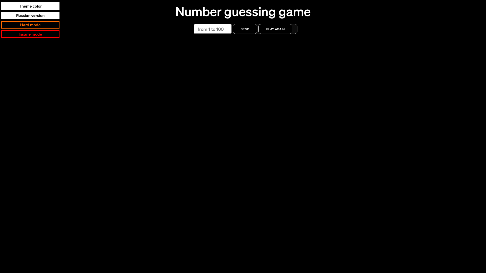

# Guess the Number Game

A simple number guessing game built with HTML, CSS and JavaScript.

## Features

- Guess the number between 1 and 100
  - Hard mode: 1 and 1000
  - Insane mode: 1 and 4 billion
- Change themes (light / black)
- Choose your language (English / Russian)
## Screenshots

## Installation
1. Clone the repository: git clone https://github.com/DenisKramarenkoS/000_site-guess-game
2. Open index.html in your browser
## Demo
[Live Demo](https://site-guess-game.vercel.app/)
